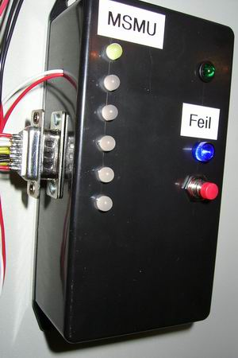

## Source code for project: [Module heartbeat monitor with 6 inputs](https://link.stdout.no/U)

Detects and alerts if any of the monitored modules goes silent; meaning their heartbeat stops. Uses an AVR ATtiny2313 microcontroller.

Written in basic, using [Bascom-AVR](http://www.mcselec.com/).

### Author
[Thomas Jensen](https://thomas.stdout.no)
